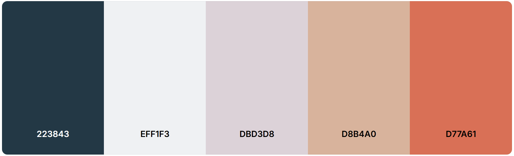

🛒🛒🛒**Market Place Application**🛒🛒🛒

This is a full-stack web application for managing and selling items. The application consists of a frontend built with React and a backend built with Node.js, Express, and PostgreSQL. Project is fully deployed on Render and images are uploaded to Cloudinary.

🌐 Deployed project: https://knit-and-sell.onrender.com/

🐳 RUNNING THE APPLICATION LOCALLY USING DOCKER:

    Requirements:
    - Docker and Docker Compose
    - Cloudinary (optional, for image uploads)

    1. Clone the repository
        git clone git@github.com:5G00EV16-3004/2025-final-project-annivm.git
        cd 2025-final-project-annivm

    2. Create .env -file in the backend folder:
        PORT=5002
        DB_USER=postgres
        DB_HOST=db
        DB_NAME=market_db
        DB_PASSWORD=market_password
        DB_PORT=5432
        JWT_KEY=my_secret_jwt_key
        FRONTEND_URL=http://localhost:8082

        # optional: for image uploads
        CLOUDINARY_CLOUD_NAME=<your-cloudinary-name>
        CLOUDINARY_API_KEY=<your-cloudinary-key>
        CLOUDINARY_API_SECRET=<your-cloudinary-secret>

    3. Create .env -file in the frontend folder:
        VITE_API_URL=http://localhost:5002

    4. Build and start the containers:
        Go to the root folder
            docker-compose up --build

        -> Backend http://localhost:5002
        -> Frontend http://localhost:8082
        -> Adminer(Database): http://localhost:8081

🖥️ RUNNING LOCALLY:

    Requirements:
    - Node.js
    - Docker and DockerCompose
    - Cloudinary (optional, used for image uploads)

    Installation (Git Bash/terminal):

    1. Clone the repository
        git clone git@github.com:5G00EV16-3004/2025-final-project-annivm.git
        cd 2025-final-project-annivm

    2. Set up the backend
        cd backend
        npm install

        Create .env -file in the backend folder:
            PORT=5002
            DB_USER=postgres
            DB_HOST=localhost
            DB_NAME=market_db
            DB_PASSWORD=market_password
            DB_PORT=5432
            JWT_KEY=my_secret_jwt_key
            FRONTEND_URL=http://localhost:5173

            # optional: for image uploads
            CLOUDINARY_CLOUD_NAME=<your-cloudinary-name>
            CLOUDINARY_API_KEY=<your-cloudinary-key>
            CLOUDINARY_API_SECRET=<your-cloudinary-secret>

        npm run dev

        -> The backend will be available at http://localhost:5002

    3. Set up the frontend
        cd ../frontend
        npm install

        Create .env -file in the frontend folder:
            VITE_API_URL=http://localhost:5002

        npm run dev

        -> The frontend will be available at http://localhost:5173

    4. Start database using docker
        docker-compose up db --build

Color palette used in this project:
https://coolors.co/palette/223843-eff1f3-dbd3d8-d8b4a0-d77a61
